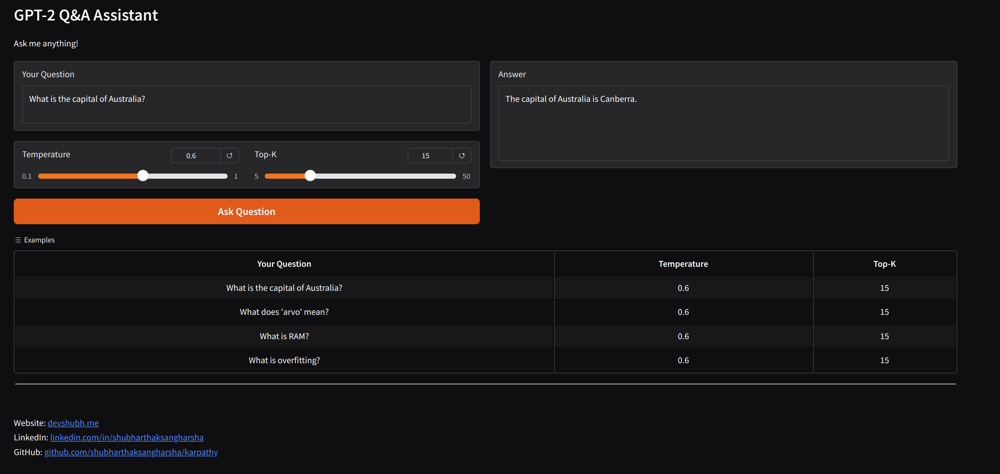

# Neural Networks: Zero to Hero

A comprehensive collection of machine learning and neural network implementations following Andrej Karpathy's "Neural Networks: Zero to Hero" course. This repository contains hands-on implementations from basic neural networks to advanced transformer architectures.



**Live Demo:** [https://gpt2.devshubh.me](https://gpt2.devshubh.me)

**Model Weights:** [https://huggingface.co/shubharthak/gpt2-124m-qa](https://huggingface.co/shubharthak/gpt2-124m-qa)

## Table of Contents

| Chapter | Title | Directory | Main Notebook | Key Concepts | Description |
|---------|-------|-----------|---------------|--------------|-------------|
| **1** | **Building Micrograd** | [`chapter1-building-micrograd/`](./chapter1-building-micrograd/) | [`mgrad.ipynb`](./chapter1-building-micrograd/mgrad.ipynb) | Value class, computational graphs, gradient computation, chain rule | Implementation of a tiny autograd engine from scratch. Learn the fundamentals of automatic differentiation, computational graphs, and backpropagation. |
| **2** | **Make More - Bigram** | [`chapter2-make-more/`](./chapter2-make-more/) | [`Building-make-more.ipynb`](./chapter2-make-more/Building-make-more.ipynb) | Bigram models, character-level prediction, probability distributions, text generation | Building a character-level bigram language model to generate names. Introduction to language modeling and probability distributions. |
| **3** | **Make More Part 2 - MLP** | [`chapter3-make-more-part2/`](./chapter3-make-more-part2/) | [`building-make-more-mlp.ipynb`](./chapter3-make-more-part2/building-make-more-mlp.ipynb) | Neural networks, embeddings, hidden layers, cross-entropy loss, optimization | Extending the bigram model to a Multi-Layer Perceptron (MLP) with embeddings and hidden layers. |
| **4** | **Make More Part 3 - Activations & BatchNorm** | [`chapter4-make-more-activations-gradients-batchnorm/`](./chapter4-make-more-activations-gradients-batchnorm/) | [`building-make-more-mlp-2.ipynb`](./chapter4-make-more-activations-gradients-batchnorm/building-make-more-mlp-2.ipynb) | Tanh activations, gradient analysis, batch normalization, training stability, deeper networks | Deep dive into neural network internals: activation functions, gradient flow, batch normalization, and training dynamics. |
| **5** | **Building WaveNet - RNNs** | [`chapter-5-building-wavenet/`](./chapter-5-building-wavenet/) | [`building-makemore-part5-rnns.ipynb`](./chapter-5-building-wavenet/building-makemore-part5-rnns.ipynb) | RNNs, hierarchical processing, sequence modeling, context windows | Introduction to Recurrent Neural Networks (RNNs) and hierarchical processing for sequence modeling. |
| **6** | **Building GPT** | [`chapter-6-building-gpt/`](./chapter-6-building-gpt/) | [`gpt-dev.ipynb`](./chapter-6-building-gpt/gpt-dev.ipynb), [`my_first_nano_gpt_train.ipynb`](./chapter-6-building-gpt/my_first_nano_gpt_train.ipynb) | Self-attention, multi-head attention, transformers, GPT architecture, positional encoding | Building a complete GPT (Generative Pre-trained Transformer) from scratch. Implementation of self-attention, multi-head attention, and transformer architecture. |
| **7** | **Building Tokenization** | [`chapter-7-building-tokenization/`](./chapter-7-building-tokenization/) | [`building-tokenization.ipynb`](./chapter-7-building-tokenization/building-tokenization.ipynb) | Tokenization, BPE, vocabulary building, text preprocessing | Understanding and implementing tokenization techniques for language models, including BPE (Byte Pair Encoding). |
| **8** | **Building GPT-2 124M** | [`chapter-8-building-gpt2-124m/`](./chapter-8-building-gpt2-124m/) | [`training-gpt-2-from-scratch-Final.ipynb`](./chapter-8-building-gpt2-124m/training-gpt-2-from-scratch-Final.ipynb) | Large-scale transformers, pre-trained models, model scaling, Hugging Face transformers | Scaling up to GPT-2 124M parameters. Working with pre-trained models and understanding large-scale transformer architectures. |
| **9** | **Fine-tuning GPT-2: SFT, RLHF & DPO** | [`chapter-9-sft-rhlf-dpo-gpt2-124m/`](./chapter-9-sft-rhlf-dpo-gpt2-124m/) | [`sft-rlhf-dpo-on-gpt2-model-final-kaggle.ipynb`](./chapter-9-sft-rhlf-dpo-gpt2-124m/sft-rlhf-dpo-on-gpt2-model-final-kaggle.ipynb) | Supervised fine-tuning (SFT), RLHF, DPO, Q&A datasets, model alignment, deployment | Fine-tuning GPT-2 124M on Q&A tasks using supervised fine-tuning and direct preference optimization. Deploy as a web application. **[Live Demo](https://gpt2.devshubh.me) • [Model Weights](https://huggingface.co/shubharthak/gpt2-124m-qa)** |

## Getting Started

### Prerequisites
- Python 3.8+
- PyTorch
- Jupyter Notebook
- NumPy
- Matplotlib
- Graphviz (for computational graphs)

### Installation
```bash
pip install torch torchvision torchaudio
pip install jupyter matplotlib graphviz
pip install transformers  # for Chapter 8
pip install tiktoken gradio  # for Chapter 9
```

### Running the Notebooks
1. Clone this repository
2. Navigate to any chapter directory
3. Open the Jupyter notebook
4. Run the cells sequentially

## Learning Path

1. **Start with Chapter 1** - Understand the fundamentals of automatic differentiation
2. **Progress through Chapters 2-4** - Build increasingly complex language models
3. **Explore RNNs in Chapter 5** - Learn about recurrent architectures
4. **Master Transformers in Chapter 6** - Implement GPT from scratch
5. **Understand Tokenization in Chapter 7** - Learn text preprocessing
6. **Scale Up in Chapter 8** - Work with large pre-trained models
7. **Fine-tune and Deploy in Chapter 9** - Apply SFT/DPO and deploy a production model

## Key Learning Outcomes

- **Automatic Differentiation**: Understanding how gradients flow through computational graphs
- **Language Modeling**: Building models that can generate coherent text
- **Neural Network Architecture**: From simple MLPs to complex transformers
- **Training Dynamics**: Understanding optimization, batch normalization, and training stability
- **Modern NLP**: Working with state-of-the-art transformer architectures
- **Model Fine-tuning**: Supervised fine-tuning (SFT) and Direct Preference Optimization (DPO)
- **Production Deployment**: Deploying ML models as web applications with systemd and Caddy

## Repository Structure

```
karpathy/
├── chapter1-building-micrograd/
├── chapter2-make-more/
├── chapter3-make-more-part2/
├── chapter4-make-more-activations-gradients-batchnorm/
├── chapter-5-building-wavenet/
├── chapter-6-building-gpt/
├── chapter-7-building-tokenization/
├── chapter-8-building-gpt2-124m/
└── chapter-9-sft-rhlf-dpo-gpt2-124m/
    ├── webapp_standalone.py
    ├── sft_train.py
    ├── dpo_train.py
    ├── checkpoints/
    └── data/
```

## Live Demo

Experience the fine-tuned GPT-2 Q&A model in action:

**Live Web App:** [https://gpt2.devshubh.me](https://gpt2.devshubh.me)

**Model Weights:** [https://huggingface.co/shubharthak/gpt2-124m-qa](https://huggingface.co/shubharthak/gpt2-124m-qa)

This interactive demo showcases a GPT-2 124M model fine-tuned on Q&A datasets covering Australian facts, technology, and general knowledge.

### Available Model Checkpoints

The Hugging Face repository includes:
- **Pretrained Model** (`model_09535.pt`) - Trained from scratch on Ultra-FineWeb Edu (5B tokens)
- **QA SFT Model** (`qa-sft_best.pt`) - Fine-tuned for Q&A tasks using Supervised Fine-Tuning

Both models are available for download and experimentation!

## Contributing

This repository follows the structure and content from Andrej Karpathy's "Neural Networks: Zero to Hero" course. Feel free to experiment with the code and extend the implementations!

## Additional Resources

- [Neural Networks: Zero to Hero - YouTube Playlist](https://youtube.com/playlist?list=PLAqhIrjkxbuWI23v9cThsA9GvCAUhRvKZ&si=SH5UXoaWnx7mwTaW)
- [GPT-2 124M Q&A Model on Hugging Face](https://huggingface.co/shubharthak/gpt2-124m-qa)
- [Karpathy's Blog](https://karpathy.github.io/)
- [PyTorch Documentation](https://pytorch.org/docs/)
- [Gradio Documentation](https://gradio.app/docs/)
- [Hugging Face Transformers](https://huggingface.co/docs/transformers/)

## License

This educational content is based on Andrej Karpathy's course materials and is intended for learning purposes.
